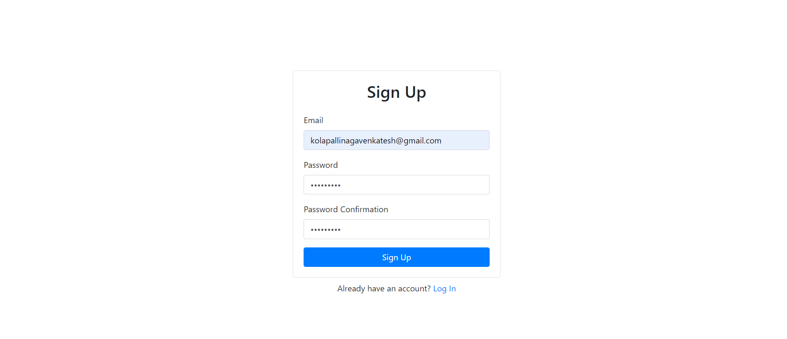
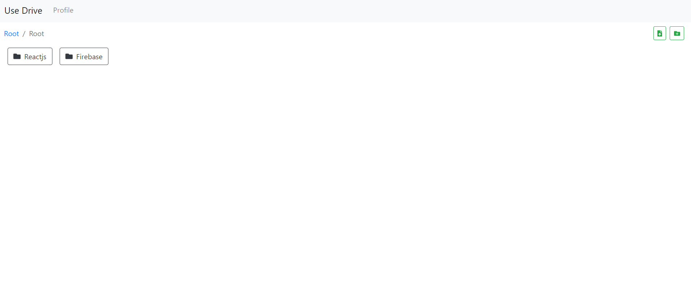
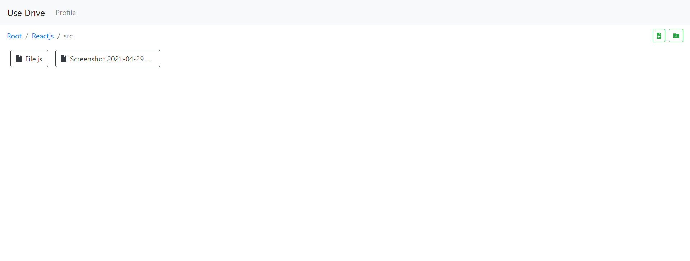

# Use Drive
## Use Drive is an optimized storage application for storing your files/documents/images
## This site is live at https://auth-development-a240e.web.app/login
## Tech Stack  

- Use Drive is a cloud-based storage application made with Reactjs and Firebase.
- You can use this application to store your files
- Create an account with your mail id 

 
- You can upload your files by creating your folders. It is entirely customizable.

- You can create as many folders as you want 

- Your files are secured by the Firebase firewall system as those files are saved in firebase.
- You can access your files from anywhere just by logging into the website.
